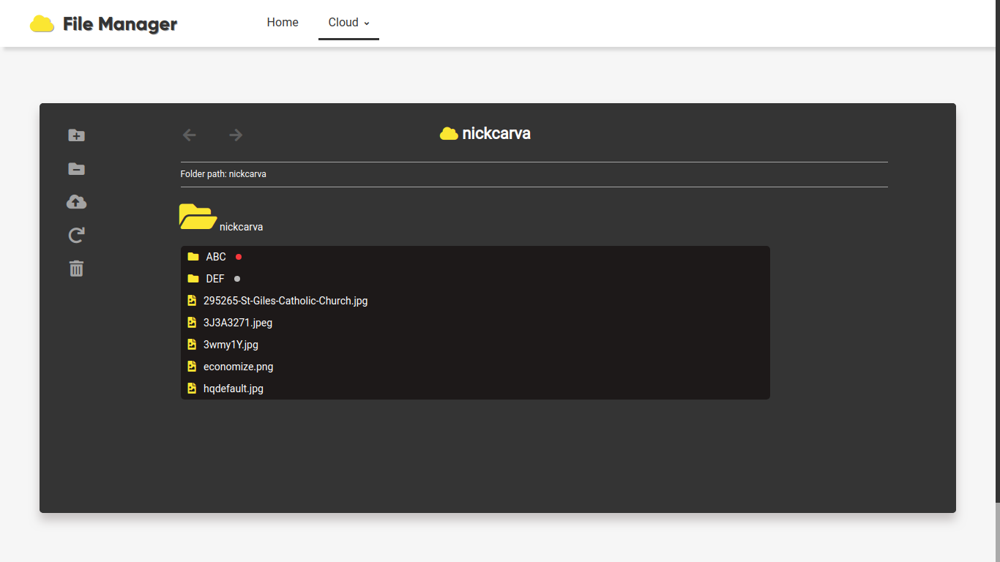

# file-manager
File manager built with jQuery and PHP.

---

### Samples:

###### Picture 1 - Home Page (Here you can choose between a cloud that already exists or create your own).
  

###### Picture 2 - Cloud Page (Here you can use whatever you want to keep safe your files and stuff).
